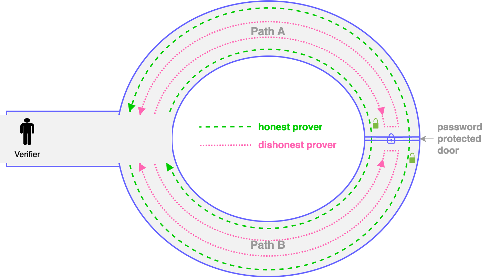

# ZKP: Zero-knowledge proofs

A **zero-knowledge proof (ZKP)** is a cryptographic protocol that allows one party, known as the prover, to demonstrate to another party, the verifier, that a specific statement is true.&#x20;

Importantly, this is achieved without revealing any additional information beyond the validity of the statement itself. Therefore, ZKPs help maintain privacy and security in digital communications and transactions.

Core principles:

1. **Completeness**: If the statement is true, an honest prover can convince the verifier of its truthfulness.
2. **Soundness**: If the statement is false, no dishonest prover can convince the verifier otherwise, except with some small probability.
3. **Zero-Knowledgeness**: If the statement is true, the verifier learns nothing more than the fact that the statement is true, gaining no additional knowledge about the actual information that constitutes the statement's truth.

Zero-knowledge proofs are used in various applications, including secure authentication processes, blockchain technology, and privacy-preserving systems.&#x20;

### Example of Zero-Knowledge Proof

**Cave of Ali Baba** is a classic illustration of a zero-knowledge proof:

Imagine a circular cave with two pathways, Path A and Path B, that converge at a locked door that only the prover can open using a secret password. The goal is for the prover to convince the verifier that they know the secret password, without revealing the password itself.

<figure><figcaption></figcaption></figure>

1. **Setup**: The verifier stands outside the cave and cannot see which path the prover takes. The prover enters the cave and randomly chooses Path A or Path B.
2. **Challenge**: After the prover is in the cave, the verifier asks them to exit through either Path A or Path B.
3. **Response**: If the prover knows the password, they can pass through the locked door and exit via the desired path. If they do not know the password, they can only exit through the path they initially entered unless they correctly guessed the verifier's challenge in advance.
4. **Repetition**: By repeating this test multiple times, say 100 times, the verifier can be confident that the prover knows the secret password if the prover consistently exits through the requested path. The probability of correctly guessing the path each time by luck diminishes exponentially with the number of trials.

This method allows the prover to demonstrate their knowledge of the secret password (the locked door's code) without revealing actual information about the password itself to the verifier, thus maintaining the zero-knowledge property.

